# DocGen-RAG

DocGen-RAG is an AI-powered tool designed to automatically generate comprehensive API documentation from source code using Retrieval-Augmented Generation (RAG). It leverages Haystack 2.0 and Weaviate to analyze codebases and produce structured documentation including Swagger specs, Postman collections, and usage examples.

## Features

- **Automated Documentation**: Generates REST API documentation from code.
- **RAG Pipeline**: Uses knowledge injection from framework documentation and codebase indexing.
- **Multi-Source Support**: Processes both local directories and Git repositories.
- **Output Formats**: Generates Swagger/OpenAPI JSON, Postman Collections, and usage examples.

## Prerequisites

- **Python**: 3.8+
- **Weaviate**: A running Weaviate instance (local or cloud).
- **OpenAI API Key**: (Optional) For generation capabilities if using OpenAI models.

## Installation

1.  **Clone the repository**:
    ```bash
    git clone https://github.com/your-repo/DocGen-RAG.git
    cd DocGen-RAG
    ```

2.  **Create and activate a virtual environment**:
    ```bash
    python -m venv rag_venv
    source rag_venv/bin/activate  # On Windows: rag_venv\Scripts\activate
    ```

3.  **Install dependencies**:
    ```bash
    pip install -e .
    ```

## Configuration

Configuration is managed via `settings.yml` and environment variables.

### `settings.yml`
Adjust RAG pipeline settings such as retrieval thresholds and model choices:
```yaml
rag:
  embedding_model: "sentence-transformers/all-MiniLM-L6-v2"
  top_k_retriever: 10
  top_k_reranker: 5
  chunk_size: 50
```

### Environment Variables
Set the following environment variables (e.g., in a `.env` file or export them):

- `WEAVIATE_URL`: URL to your Weaviate instance.
- `WEAVIATE_API_KEY`: (If authentication is enabled).
- `OPENAI_API_KEY`: Required for the generator component if using OpenAI.

## Usage

1.  **Start the Server**:
    ```bash
    uvicorn src.api.main:app --host 0.0.0.0 --port 8000 --reload
    ```

2.  **Trigger Generation**:
    Send a `POST` request to `/generate`:

    **Endpoint**: `http://localhost:8000/generate`

    **Body (Local)**:
    ```json
    {
        "source_type": "local",
        "path": "/absolute/path/to/project"
    }
    ```

    **Body (Git)**:
    ```json
    {
        "source_type": "git",
        "path": "https://github.com/username/repo.git",
        "credentials": "optional_token"
    }
    ```

3.  **Check Output**:
    Documentation artifacts will be generated in `output/<timestamp>/`.

## Project Structure

- `src/api`: FastAPI application entry point.
- `src/core`: Configuration and security settings.
- `src/pipelines`: Haystack RAG pipelines for indexing and generation.
- `src/services`: Core logic for input handling, framework detection, and document generation.
- `settings.yml`: Configuration file.

## Current RAG System Chart

```mermaid
graph TD
    %%  Input Sources
    Input1(["Local Codebase Folder"])
    Input2(["GitHub Repo URL"])
    
    %% 2-3. Processing
    LF[" Language Finder"]
    FF[" Framework Finder"]
    
    %%  Decision Logic
    RF{"REST Component Finder"}
    Stop(["Error: Not a REST API"])
    
    %%  Vectorization
    SaveLatest[(" Vectorization Weaviate Storage")]
    
    %% 8-9. Documentation Logic
    CheckDB{" Doc Template exists"}
    WebSearch[" Web Search Latest API Specs"]
    VEC[" Weaviate Latest Framework Docs"]
    
    %% 10-13. Retrieval and Generation
    Retriever[" Context Retriever Tenant Isolated"]
    Rerank[" Reranking and Prompt Augmentation"]
    LLM[" Final LLM Generation JSON"]
    HTML[" Static HTML Documentation"]

    %% Connections
    Input1 --> LF
    Input2 --> LF
    LF --> FF
    FF --> RF
    
    RF -- No --> Stop
    RF -- Yes --> VEC
    
    VEC --> CheckDB
    
    CheckDB -- No --> WebSearch
    WebSearch --> SaveLatest
    SaveLatest --> Retriever
    
    CheckDB -- Yes --> Retriever
    
    Retriever --> Rerank
    Rerank --> LLM
    LLM --> HTML

    %% Styling
    style Stop fill:#ff0000,stroke:#333
    style VEC fill:#0000ff,stroke:#333
    style SaveLatest fill:#0000ff,stroke:#333
    style RF fill:#301934,stroke:#000
    style CheckDB fill:#301934,stroke:#d4a017
    style Input1 fill:#001,stroke:#333
    style Input2 fill:#001,stroke:#333

```

